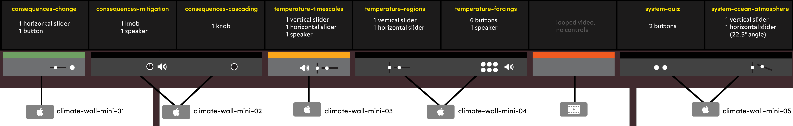

# HoPE-specific instructions

This is an internal document that is specific to the AMNH HoPE installation and maintenance.

## Troubleshooting apps

For any issues with the software, usually a restart of the computer will fix the problems.

For any issues with the hardware (e.g. sliders not working), you will need to contact A/V to potentially replace the slider or board.

## Overview of setup

The HoPE wall interactives are configured like so:

[](img/wall_diagrams_inputs.png)

- There are 5 Mac Minis running 8 interactives
- 3 of the Macs are running dual screen outputs
- 2 of the Macs have audio output
- All of the Macs have inputs from [physical controls](controls.md) via USB
- There is a single machine that is simply looping video with no input or audio output

All macs are configured to restart overnight, every night at 3:45am.

## Updating apps

You can refer to the [development](development.md), [deployment](deployment.md), and [controls](controls.md) documents for the specifics of how to develop and deploy apps. There are 5 commands that correspond to building apps for the 5 respective Mac Minis from left to right:

```
sudo npm run build:mac1
sudo npm run build:mac2
sudo npm run build:mac3
sudo npm run build:mac4
sudo npm run build:mac5
```

Once you build these on your machine:

1. Do a screenshare to each of the Macs (e.g. `climate-wall-mini-01`).
2. `Cmd+Q` to quit the current app
3. Drag-and-drop the appropriate app (e.g. `hope-mac-1`) onto the desktop of the corresponding machine.
4. Go to `/Applications` directory and remove the current app (e.g. `hope-mac-1`)
5. Drag the new app from the desktop to the `/Applications` directory
6. Restart the computer
7. Disconnect from screenshare (it's important to explicitly disconnect since there may be a warning dialog box for unclosed screenshare connections on the machine)

There's one exception for the 2nd mac (`hope-mac-2`.) It also has another app that is running called `hope-mac-2-checker` which periodically checks if `hope-mac-2` is running. This app also needs to be quitted after step 2, otherwise, `hope-mac-2-checker` will automatically restart the computer after some time. You can read the [provisioning](provisioning.md) document for more details about this.
